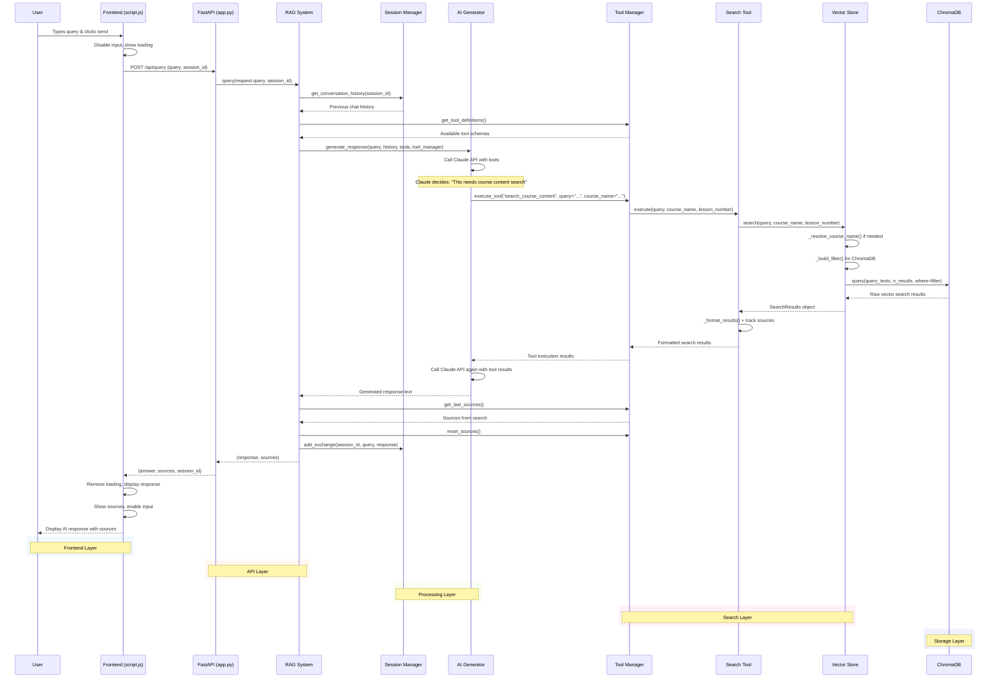

# RAG System Query Flow Diagram

## Key Components & Flow

### 1. **Frontend (script.js)**
- User input handling
- Loading states
- API communication
- Response display with sources

### 2. **API Layer (app.py)**  
- FastAPI endpoint `/api/query`
- Request validation
- RAG system orchestration

### 3. **Processing Layer**
- **RAG System**: Main orchestrator
- **Session Manager**: Conversation history
- **AI Generator**: Claude API integration

### 4. **Search Layer**
- **Tool Manager**: Tool registration & execution
- **Search Tool**: Course content search logic
- **Vector Store**: ChromaDB interface

### 5. **Storage Layer**
- **ChromaDB**: Vector embeddings & metadata

## Flow Highlights

1. **Tool-Based Architecture**: Claude decides when to search using function calling
2. **Smart Course Resolution**: Semantic matching for course names  
3. **Context Preservation**: Session history maintained throughout
4. **Source Tracking**: UI shows which courses/lessons were referenced
5. **Error Handling**: Graceful fallbacks at each layer